# CMS Blog Website in PHP & MySQL

##  Libraries
*   ###### [Bootstrap](https://getbootstrap.com/)
*   ###### [sweetalert2](https://sweetalert2.github.io/#download)

## Login

## Admin Home

#### Preview

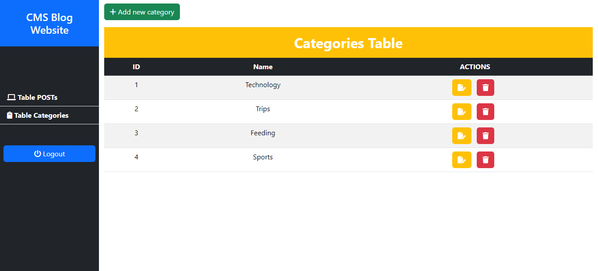

#### Preview

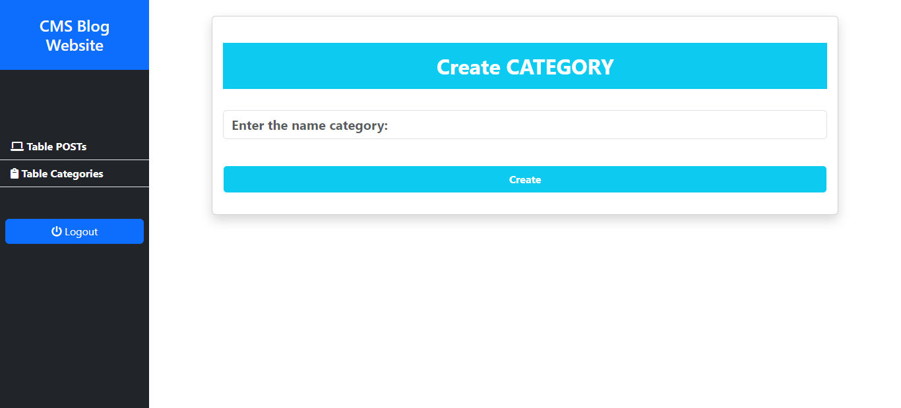

#### Preview

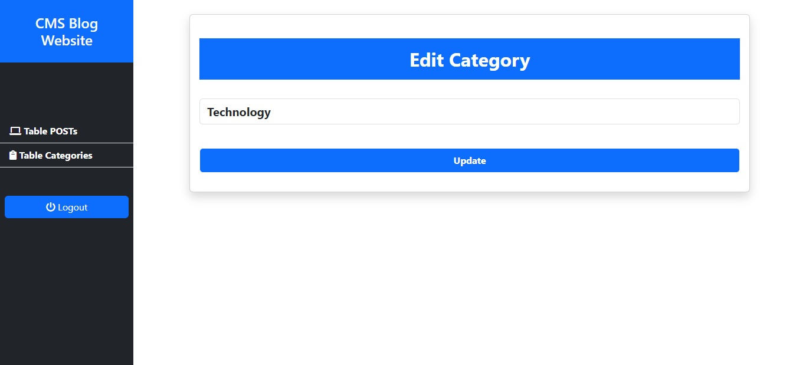

#### Preview

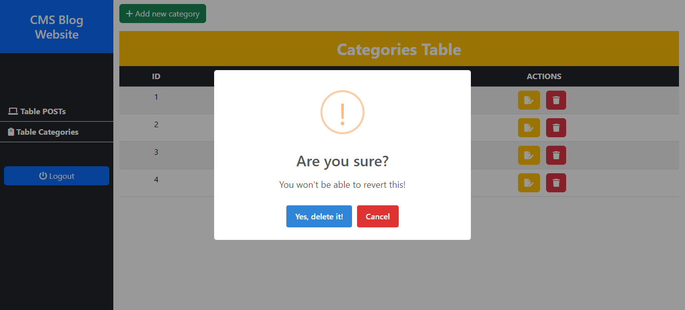

#### Preview

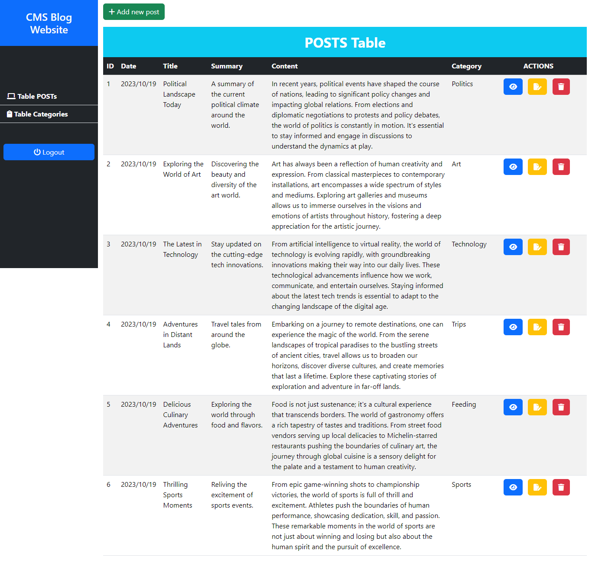

#### Preview

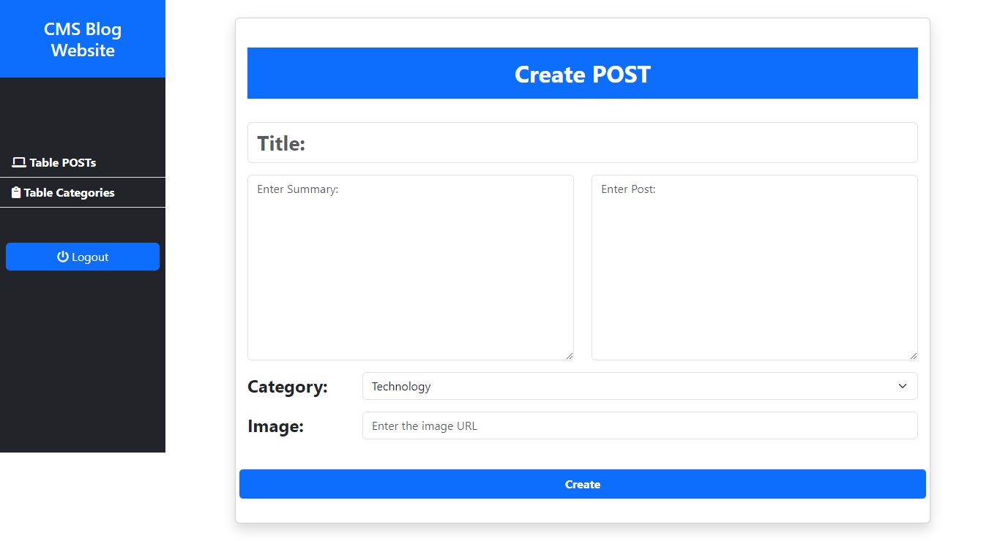

#### Preview

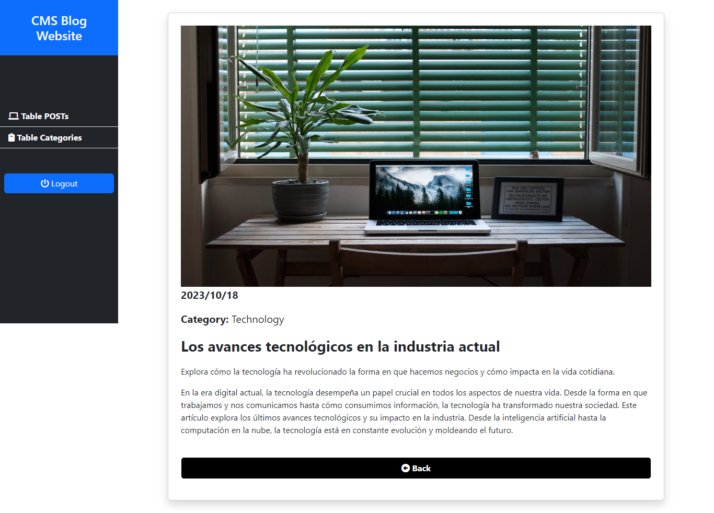

#### Preview

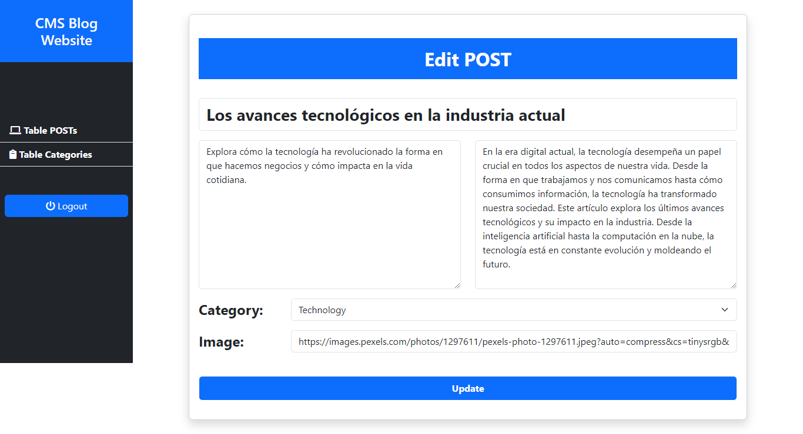

#### Preview

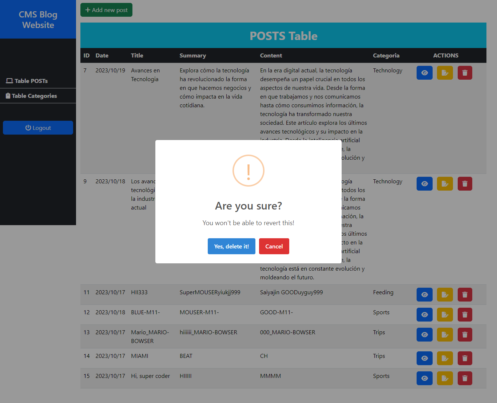

## User Home

#### About

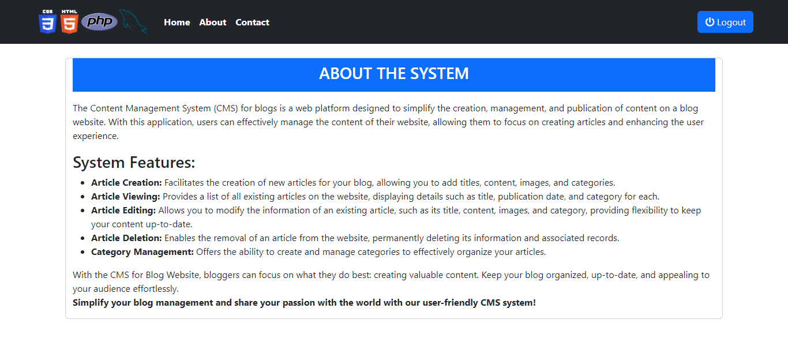

#### Contact

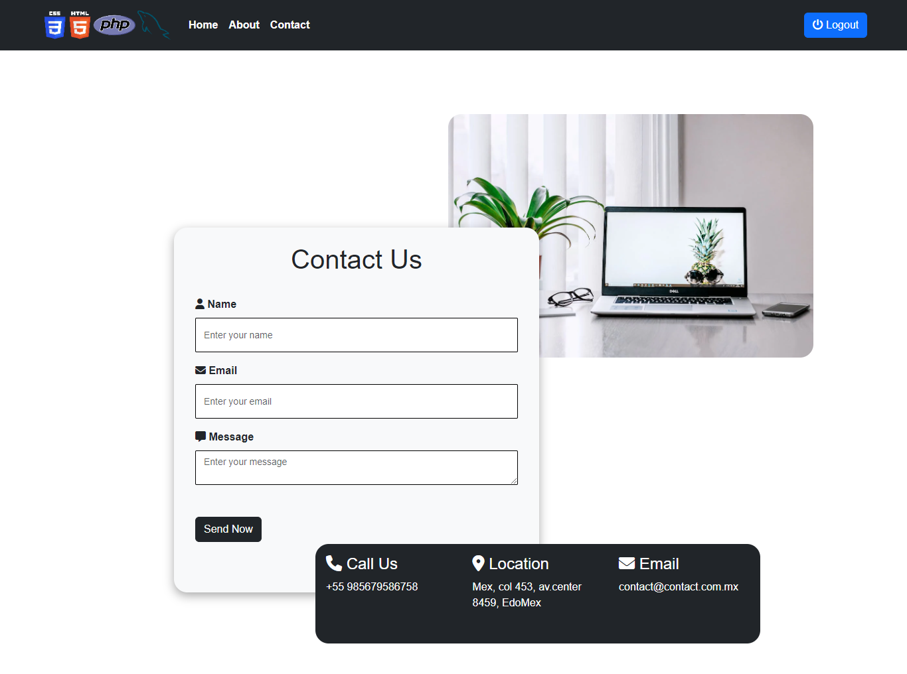
